<h3 align="center">Ichiki</h3>

  <strong>Frontend Engineer</strong> · Tokyo · <a href="https://ichiki.me">ichiki.me</a>

 

  <em>I build web and mobile products with React and React Native. 
  I focus on removing the unnecessary and leaving calm, comfortable experiences for the people who use them.</em>

 

  <strong>Tech Stack</strong>

  
  
  
  
  
  
  

 

  <strong>GitHub Stats</strong>

  
  

